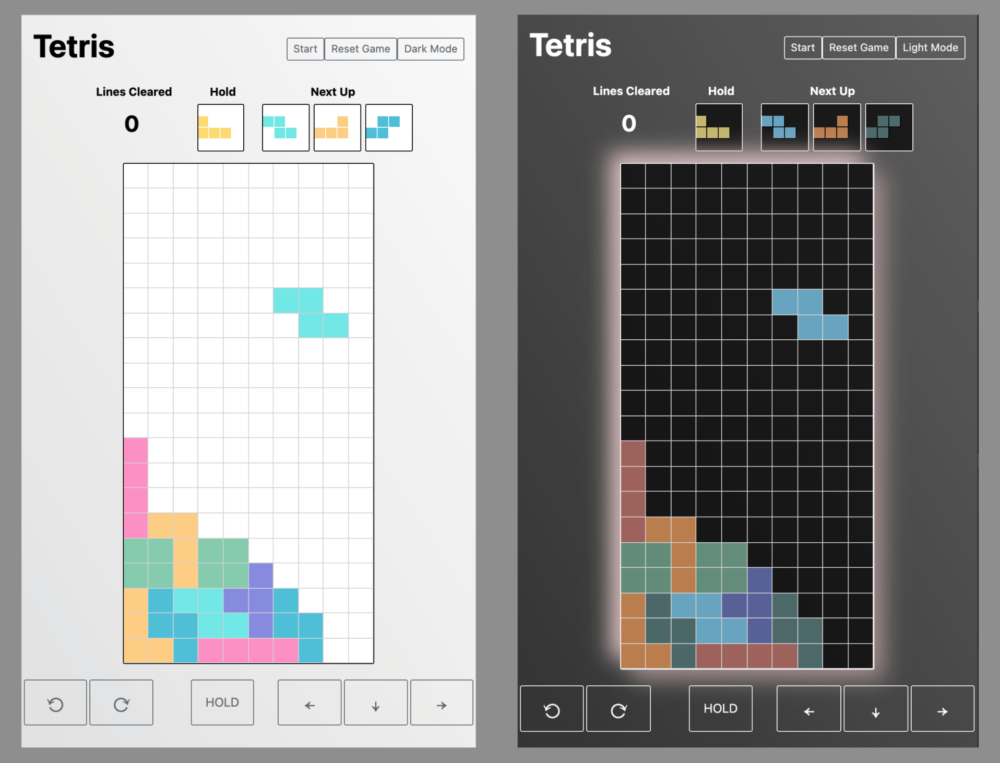

# Project 1: Tetris!

I recreated the beloved game of Tetris as a tribute for all the time I dedicated to its art during my college classes. This web-based browser game can be played on both computers and mobile devices.

The objective of the game is to clear as many lines as you can with the blocks provided to you. Blocks appear at the top of the board and automatically drop down towards the bottom. As the user, you are able to shift or rotate the block using either set keyboard inputs or on-screen buttons for the mobile application. The game is over once no further blocks can be placed on the board.
#
# [Play Tetris now!](https://christinew2-tetris.netlify.app/)

## Getting Started
- Begin the game by pressing "Start" on the top of the page. This will initiate the game by automatically moving the block down. 
- You may pause or restart the game at any point using the buttons at the top of the page.
- "Next Up" displays upcoming blocks.
- "Hold" is a feature that allows the user to store a block for later use. 
  

This game uses the following keyboard inputs
  

#
## Technologies Used
- HTML
- CSS
- Javascript
#
## Next Steps/ Future Enhancements
- [ ] Fix color blocks when lines clear
- [ ] Add control panel pop-up screen to show controls
- [ ] Allow user to change control keys 
- [ ] Add audio: music and sound effects 
- [ ] Add settings panel for ability to toggle sounds
- [ ] Add ghost piece feature that previews where the block will land
- [ ] Add hard drop ability
- [ ] Integrate the Super Rotation System (SRS), including offsets for rotation at the borders
- [ ] Add levels & increase dropping speed
- [ ] Add multipliers to the scoreboard when multiple or consecutive lines are cleared
- [ ] Implement rule that user cannot hold consecutively
- [ ] Refactor code so that blocks are centered in Hold and Next Up containers

#
## References
- Tetris information and mechanics: [Tetris Wiki](https://tetris.fandom.com/wiki/Tetris_Wiki)
- HTML/CSS/Javascript reference: [MDN](https://developer.mozilla.org/en-US/)
- CSS Flexbox & Grid reference: [CSS Tricks](https://css-tricks.com/)
- Gradient background: [ColorSpace](https://mycolor.space/)
- Buttons: [Bootstrap](https://getbootstrap.com/)